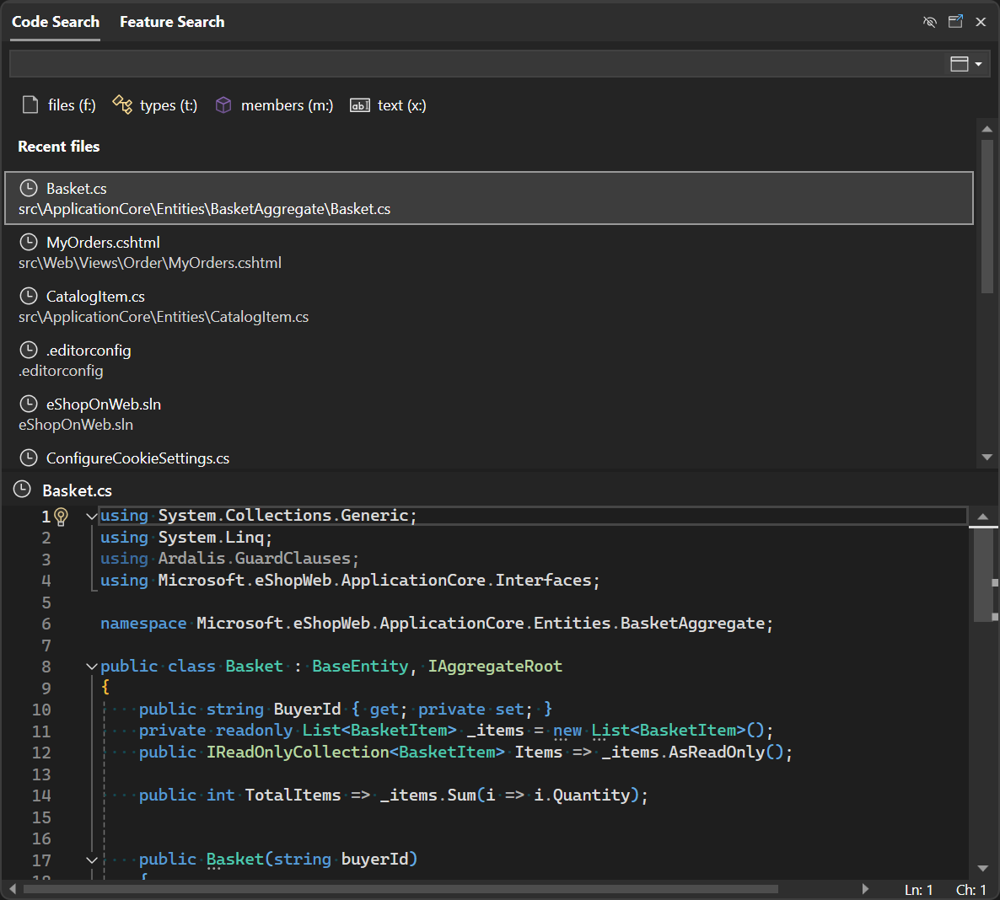

Мы сделали навигацию по коду еще проще. 

Теперь при открытии функции [Поиск кода](vscmd://Edit.NavigateTo) без запроса появится список недавних файлов. К ним относятся файлы, открытые с помощью функции "Поиск кода", а также другие файлы, которые открыты в решении. Это упрощает переход к файлу, над которым вы недавно работали, без необходимости запоминать или вводить имя файла.

