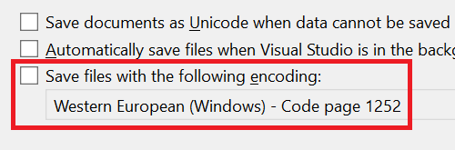

У специалистов, которые разрабатывают приложения в межплатформенных средах, часто возникает необходимость сохранять файлы с использованием определенной кодировки. Изменение этих кодировок может вызвать самые разные проблемы.

Теперь в Visual Studio появилась возможность указать кодировку, которая будет по умолчанию использоваться при сохранении файлов. Это позволяет обеспечить использование выбранной кодировки во всех возможных случаях.

Чтобы задать кодировку по умолчанию, перейдите в раздел **Сервис > Параметры > Среда > Документы**. Там доступен параметр **Сохранять файлы с определенной кодировкой**. Если этот параметр не отмечен, Visual Studio будет управлять кодировкой файлов, используя поведение по умолчанию. Если он отмечен, при каждом сохранении файла Visual Studio будет использовать кодировку, которая указана в соседнем поле со списком.

Если Visual Studio не может сохранить файл с указанной кодировкой (например, запрашивает кодировку *ASCII* для файла, содержащего символы в формате Unicode), откроется диалоговое окно с информацией о проблеме.
