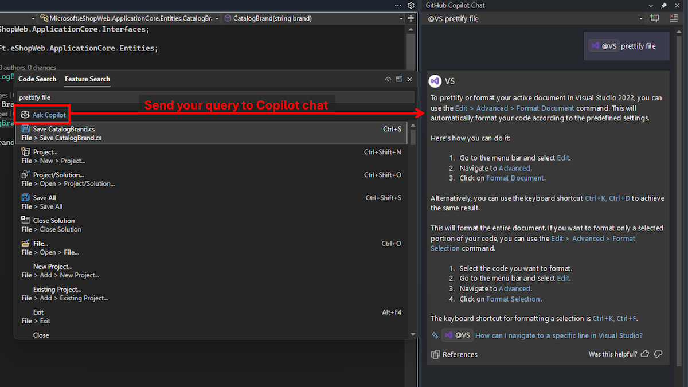

Например, вам может понадобиться найти определенный пункт меню, команду или параметр в Visual Studio, однако вы не знаете их название или расположение. Или вам могут пригодиться подробные сведениями о том, как правильно его использовать.

Теперь в [поиске функций](vscmd://Window.QuickLaunch) можно отправить запрос в чат Copilot, чтобы получить подробный ответ. Если вы не знаете точно, как называется функция, чат Copilot может интерпретировать смысл запроса, учесть версию Visual Studio и предоставить ответ прямо в интегрированной среде разработки.

Например, в настоящий момент с помощью запроса "украсить" в поиске функций нельзя найти параметр "формат документа". Но чат Copilot может определить и объяснить соответствующие элементы в Visual Studio.

Если в Visual Studio настроена подписка на Copilot, вы можете просто начать вводить запрос в [поиске функций](vscmd://Window.QuickLaunch), а затем нажать кнопку **Спросить Copilot**, чтобы отправить его в чат. 

Эта интеграция оптимизирует ваш рабочий процесс, так как предоставляет быструю контекстно-зависимую помощь напрямую в интегрированной среде разработки.

### Хотите попробовать?
Активируйте GitHub Copilot Free и получите доступ к этой ИИ-функции, а также другие возомжности.
 Никаких пробных периодов. Не нужна кредитная карта. Только ваша учетная запись на GitHub. [Скачать Copilot Free](vscmd://View.GitHub.Copilot.Chat).
