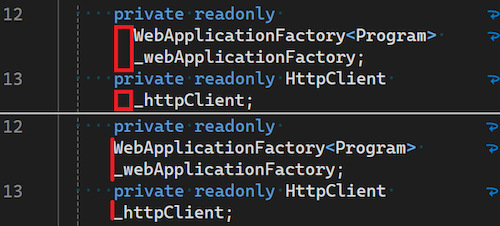

Рады представить новую функцию, позволяющую управлять отступом переносимых строк в редакторе. Это усовершенствование обеспечивает большую гибкость и настраиваемость среды кодирования, благодаря чему ваш код будет выглядеть именно так, как вы задумали.

Для изменения этого параметра выполните следующие шаги:

1. Выберите **Инструменты > Параметры > Текстовый редактор > Общие**.
2. Перейдите к параметру **Автоматически делать отступы при включенном переносе слов**.

По умолчанию эта опция включена, то есть при переносе строки будут иметь отступ. Если вы предпочитаете, чтобы перенесенные части строк не имели отступа, флажок можно снять. Эта настройка может помочь улучшить читаемость и сохранить желаемое форматирование кода, особенно в проектах, в которых стиль отступов чрезвычайно важен.

Выражаем искреннюю надежду, что эта новая функция поможет повысить эффективность вашей работы и сделает процесс программирования более комфортным.
