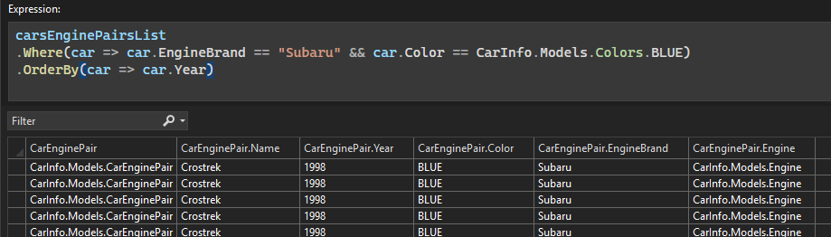

LINQ ifadeleri yazmak, özellikle ifadeler karmaşık bir şekilde büyüdükçe karmaşık olabilir. Visual Studio 2022 şimdi **IEnumerable Görselleştirici Düzenlenebilir İfadesi**'nde **söz dizimi vurgulama** özelliğini tanıtıyor.

Söz dizimi vurgulama, sorgularınızın sınıflar, sabit listeler, temsilciler, yapılar ve anahtar sözcükler gibi belirli bölümlerine farklı renkler uygular. Bu, LINQ ifadelerinizdeki çeşitli bileşenleri belirlemeyi ve mantıksal akışı bir bakışta görmeyi basitleştirerek daha net ve daha sürdürülebilir bir kod sağlar.

### Söz dizimi vurgulamayı özelleştirme

Visual Studio, renk düzenini tercihlerinize uyacak şekilde özelleştirmenize olanak tanır. Renklerinizi kişiselleştirmek için:

1. **Araçlar > Seçenekler > Ortam > Yazı Tipleri ve Renkler**'e gidin.
2. **Şunun için ayarları göster** açılan listesinden **Metin Düzenleyicisi**'ni seçin.
3. Her **Kullanıcı Türü** öğesinin rengini kodlama stilinize uyacak şekilde ayarlayın.
