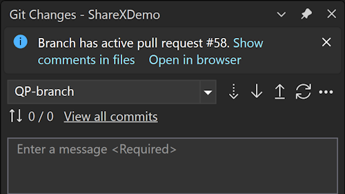
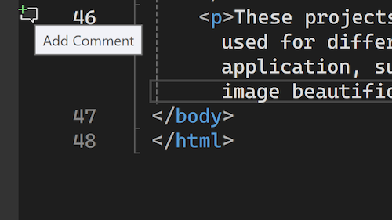

透過最新更新，您現在可以為簽出分支上的提取請求檔案新增註解。 這是針對提取要求體驗的最熱門要求，也是在 Visual Studio 中針對提取要求體驗的一系列增強功能中的最新要求。

### 開始使用

啟用 [提取要求註解]**** 和 [提取要求新增註解]**** 功能旗標、簽出所有具有作用中提取要求的分支，並選取資訊列中的 [在檔案中顯示註解]****。 這樣將在編輯器中啟用提取要求註解體驗。

******** 若要將新的註解新增至檔案，請選取邊界處的 [新增註解] 圖示，或以滑鼠右鍵按一下您想要新增註解的行，然後從內容功能表中選擇 [Git >新增註解]。

注意：該圖示僅顯示在提取要求的檔案中。 對於 GitHub 提取請求，您只能對已變更行周圍的行 (包括這些行) 進行註解。
