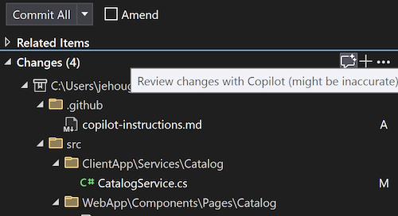
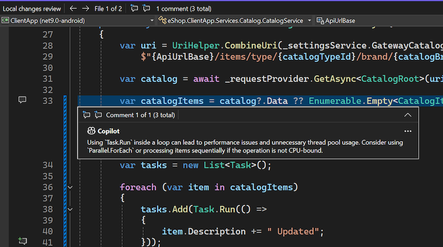

現在，您甚至可以在認可之前，先取得本機變更的 GitHub Copilot 程式碼檢閱！ 在 Visual Studio 中啟用 Copilot 訂用帳戶並啟用下列功能旗標後，即可在 [Git 變更] 視窗中看到新的閃爍 [註解] 按鈕。 按一下時，Copilot 會檢查您的變更內容，並在編輯器中提出一些內嵌建議。

此模型可以指出危急問題，例如潛在效能和安全性問題；及早發現這些問題，有助於降低將問題推送至遠端程式碼基底的風險。

請確定已開啟下列兩個功能旗標：

- [工具]**** >  [選項]**** >  [預覽功能]**** >  [提取要求註解]****
- [工具]**** >  [選項]**** >  [GitHub]**** >  [Copilot]**** >  [原始檔控制整合]**** >  [啟用 Git 預覽功能]****。

### 想要試用嗎？
啟用 GitHub Copilot 免費版，即可解鎖此 AI 功能以及更多功能。
 無試用期限。 無需信用卡。 只需擁有 GitHub 帳戶即可。 [取得 Copilot 免費版](vscmd://View.GitHub.Copilot.Chat)。
