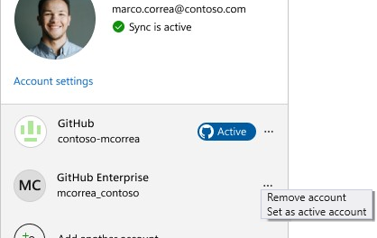

您的開發案例需要使用不同的 GitHub 帳戶嗎？ Visual Studio 現在可讓您同時擁有多個 GitHub 帳戶！

### 新增多個 GitHub 帳戶
新增多個帳戶輕而易舉！ **** 只要開啟個人檔案卡片、選取 [新增其他帳戶]，然後登入 GitHub 帳戶，並視需要重複步驟即可。

您也可以從 **[檔案 > 帳戶設定...]** 下方的 [帳戶設定] 對話方塊新增帳戶。

### 設定使用中的 GitHub 帳戶

如果您新增多個 GitHub 帳戶，Visual Studio 會預設為針對 GitHub 感知功能標示為*使用中*的帳戶，例如版本控制與 Copilot。 

**** 若要切換使用中的帳戶，請存取帳戶選項，然後選取 [設定為使用中帳戶] 按鈕。

### 對 GitHub Copilot 的影響

當使用中的 GitHub 帳戶訂閱個人用 GitHub Copilot 或商務用 GitHub Copilot 時，Copilot 會自動啟動。

### 對版本控制的影響

在處理 GitHub 提取要求或問題時，您將會收到設定 GitHub 帳戶的提示。 每當您處理特定存放庫時，我們都會記住您的喜好設定，以便在您變更存放庫時，不必擔心將帳戶切換為用於一般 Git 作業，例如推送、提取和擷取。 如果發生不相符的情況，您也會收到更新使用中帳戶的提示，以避免使用錯誤的帳戶。

### 想要試用嗎？
啟用 GitHub Copilot 免費版，即可解鎖此 AI 功能以及更多功能。
 無試用期限。 無需信用卡。 只需擁有 GitHub 帳戶即可。 [取得 Copilot 免費版](vscmd://View.GitHub.Copilot.Chat)。
